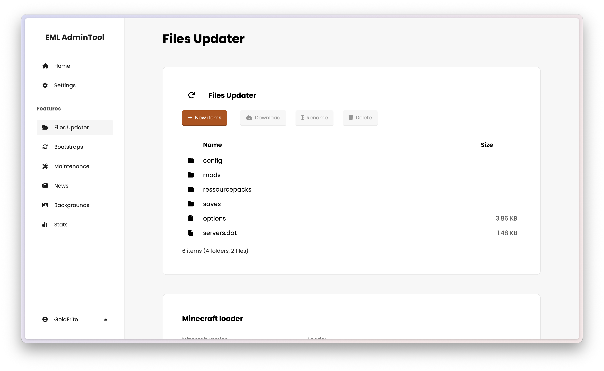

# EML AdminTool

**EML AdminTool is a Web software to manage a Minecraft Launcher built with [EML Lib](https://github.com/Electron-Minecraft-Launcher/EML-Lib-v2) library.**



[<p align="center">](https://discord.gg/YVB4k6HzAY)
[](#platforms) 
[](package.json)</p>

---


## Features

 * **Files Updater**: Update your Minecraft files and loader (Vanilla or Forge).
 * **Bootstraps**: Auto-update your Minecraft Launcher.
 * **Maintenance**: Manage your Minecraft Launcher.
 * **News**: Manage your Minecraft Launcher news.
 * **Background**: Manage your Minecraft Launcher background.
 * **Stats**: See stats about your Launcher.
 * The Admin of the server can manage the users permissions.
 * And more...


## Installation

###### For more information, please read the [installation guide](https://github.com/Electron-Minecraft-Launcher/EML-AdminTool-v2/wiki/Installation-and-setup).

### Minimum VPS requirements

You have to use a compatible **VPS**.

You can choose your Linux distribution, but Debian or Ubuntu is highly recommended.


|              | Minimum       | Recommended    |
|--------------|---------------|----------------|
| CPU          | 2 core 2 GHz. | 4 cores 2 GHz  |
| RAM          | 2 GB          | 4 GB           |
| Storage      | 5 GB free     | 50 GB SSD free |

> [!NOTE]
> The Launcher can make many requests to EML AdminTool. If your Minecraft serveur doesn't have a lot of players, you can use a VPS with low requirements. However, if you have a lot of players, you should use a VPS with high requirements, to avoid any performance issues or crashes.

### Software requirements

You have to install the following software on your VPS:
- [Docker](https://docs.docker.com/engine/install) and [Docker Compose](https://docs.docker.com/compose/install) [^1]
- [NGINX](https://docs.nginx.com/nginx/admin-guide/installing-nginx/installing-nginx-open-source/) or [Apache](https://httpd.apache.org/docs/2.4/install.html) (optional, but NGINX is recommended) [^2]

Node.js is not required, because it is already included in the Docker image of EML AdminTool.

### EML AdminTool installation

Then, in a terminal, execute the following command:
```bash
# with wget
wget -qO- https://raw.githubusercontent.com/Electron-Minecraft-Launcher/EML-AdminTool-v2/main/.github/scripts/eml-admintool@2.0.0-2 | bash
# with curl
curl -sSL https://raw.githubusercontent.com/Electron-Minecraft-Launcher/EML-AdminTool-v2/main/.github/scripts/eml-admintool@2.0.0-beta.2 | bash
```

### Web server configuration

We assume that you have a domain name and a subdomain already configured from your registrar for EML AdminTool, and an SSL certificate. For exemple, [emlat.my-minecraft-server.com](https://emlat.my-minecraft-server.com).

You have to configure your web server to use EML AdminTool.

<details>
<summary>NGINX configuration example</summary>
NGINX configuration file (this is an example, you have to adapt it to your configuration):

```nginx
server {
  listen 443 ssl;
  listen [::]:443 ssl ipv6only=on;
    
  keepalive_timeout 70;

  ssl_certificate /path/to/your/certificate.crt;
  ssl_certificate_key /path/to/your/private_key.key;
  ssl_protocols TLSv1 TLSv1.1 TLSv1.2 TLSv1.3;
  ssl_ciphers HIGH:!aNULL:!MD5;

  location / {
    proxy_pass http://localhost:3000;
    proxy_http_version 1.1;
    proxy_set_header Upgrade $http_upgrade;
    proxy_set_header Connection 'upgrade';
    proxy_set_header Host $host;
    proxy_cache_bypass $http_upgrade;
  }
}
```

</details>

<details>
<summary>Apache configuration example</summary>
Apache configuration file (this is an example, you have to adapt it to your configuration):

```apache
<VirtualHost *:443>
  ServerName emlat.my-minecraft-server.com

  SSLEngine on
  SSLCertificateFile /path/to/your/certificate.crt
  SSLCertificateKeyFile /path/to/your/private_key.key

  ProxyPreserveHost On
  ProxyRequests On
  ProxyPass / http://localhost:3000
  ProxyPassReverse / http://localhost:3000
</VirtualHost>
```

</details>

For more information, you can read the [NGINX documentation](https://nginx.org/en/docs) or the [Apache documentation](https://httpd.apache.org/docs/2.4).

### EML AdminTool start

You can now start EML AdminTool with the following command:
```bash
cd EML-AdminTool-v2/docker
docker-compose -f docker-compose.prod.yml up
```

> [!TIP]
> You can use the `-d` option to start EML AdminTool in the background. You can also use a process manager like PM2, or even create a systemd service, to start EML AdminTool automatically when your VPS starts.

### If you won't use a VPS

You can download the previous major version of the [EML AdminTool](https://github.com/Electron-Minecraft-Launcher/EML-AdminTool). However, be careful, this version is no longer maintained and has security vulnerabilities.


## Contributing

### Translation

You can help to translate EML AdminTool!

The languages files are [here](./client/src/lib/locales/). You can create another file with your translation. Please make sure to provide a correct translation!

Then, you can submit your translation file as an [issue](https://github.com/Electron-Minecraft-Launcher/EML-AdminTool-v2/issues/new?template=translation.md), by using the *Language* issue template. Your file needs to be checked and approved by two other persons.

### Development

Install [Node.js](https://nodejs.org/en/download/package-manager) and [Docker](https://www.docker.com/get-started) [^3].

Then, download the code and run the command:
```bash
cd EML-AdminTool-v2
npm i
```

You can now start the development server:
```bash
cd docker
docker-compose -f dockerfile.dev.yml up
```

The application is accessible at [http://localhost:5173](http://localhost:5173). You can also access pgAdmin at [https://localhost:8080](http://localhost:8080).

You can now make pull requests!


## Important information

* This repository contains a `.env` file. All the information in this file is fake (random strings), and will be replaced by the real information when you install EML AdminTool.
* This Web software is under the `GNU GPLv3` license; to get more information, please read the file `LICENSE`. It is legally obligatory to respect this license.
* If you need some help, you can join [this Discord](https://discord.gg/nfEHKtghPh).

<br>

[^1]: The Docker Engine installation tutorial from the official Docker documentation includes the installation of Docker Compose.

[^2]: NGINX (or Apache) is recommended to use EML AdminTool in production. It allows you to use a domain name and an SSL certificate. If you don't use NGINX (or Apache), you can use EML AdminTool with the IP address of your VPS. However, it is not recommended to use EML AdminTool without a domain name and an SSL certificate.

[^3]: On desktop (Windows, macOS and Linux), you can use Docker Desktop, which includes Docker and Docker Compose. On a server (Linux), you should install Docker and Docker Compose separately.
